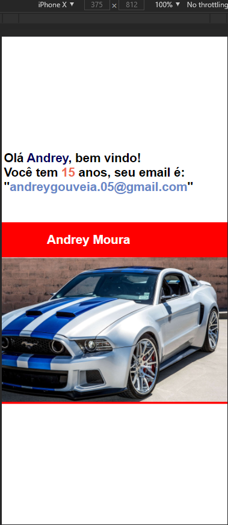

# Hello World PHP

### Primeira vez fazendo uma atividade com php. Nesta o objetivo era atribuir o valor das variáveis, e mostrá-los através do 'echo'.
### A segunda parte, era necessário utilizar o background color numa variavel e uma foto via url.

